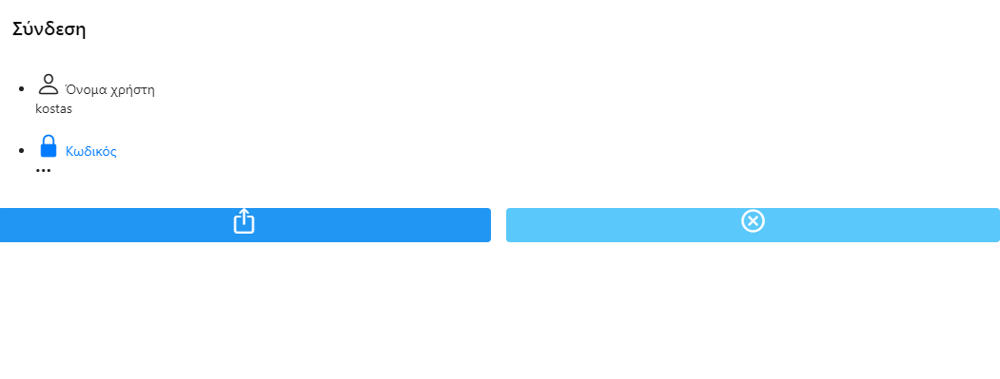
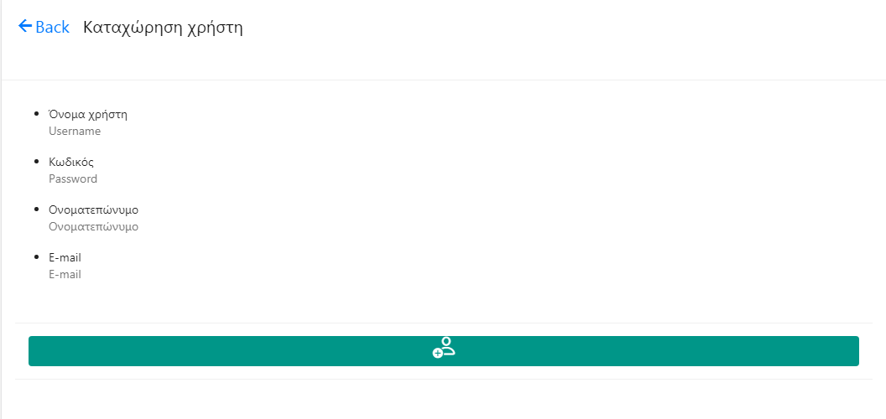
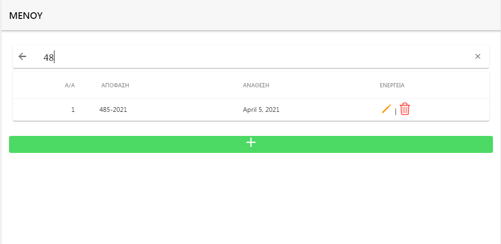
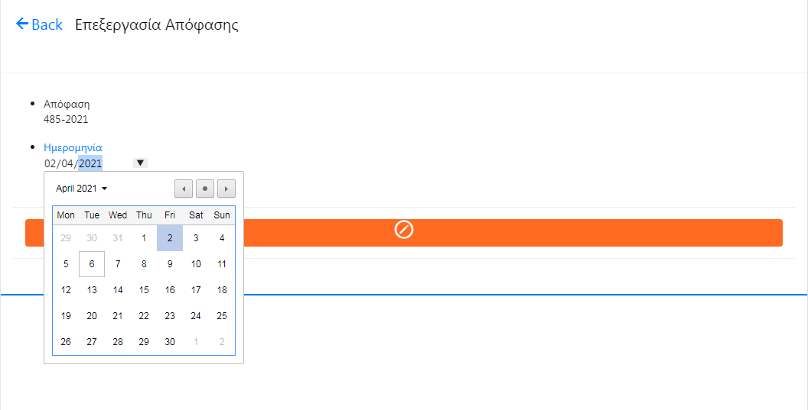
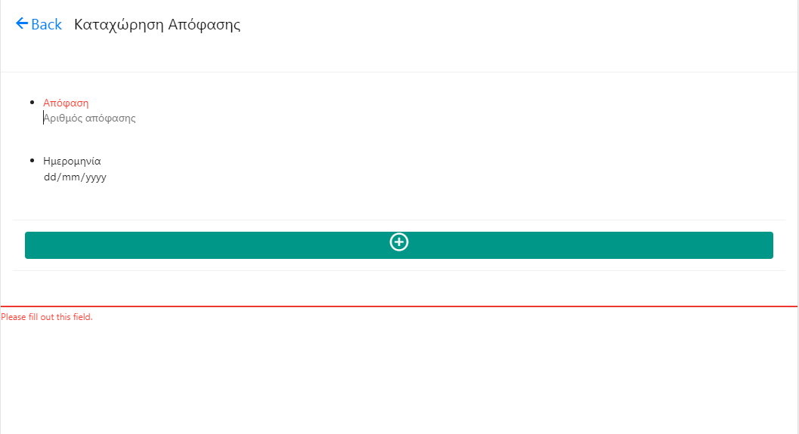

							     Tasks Assignment app
										
A CRUD mobile view app where every user is able to register significant information for prejudicial appeals, judgements and appeals' technical assistance. The user has also the ability to search for these types of tasks according to specific criteria such as appeals' technical assistance description, judgements' name and prejudicial appeals' participants. Additionally he can edit or delete selected information via appropriate forms or confirmation messages.

This mobile view app provides a login screen for authentication of existing user and also registration for new user after receiving a notification email for account activation to a specific Web link.

This app has been made via [Framework7](https://framework7.io/) as frontend app, [MySQL](https://www.mysql.com/) as DBMS and [Framework One](http://framework-one.github.io/) (fw/1) as backend app, where [Lucee server](https://www.lucee.org/) 5.x is required to be installed via [Commandbox](https://www.ortussolutions.com/products/commandbox) for its successful operation.

**Login view**

**Registration view**

**Search view**

**Edit view**

**Insert view**

